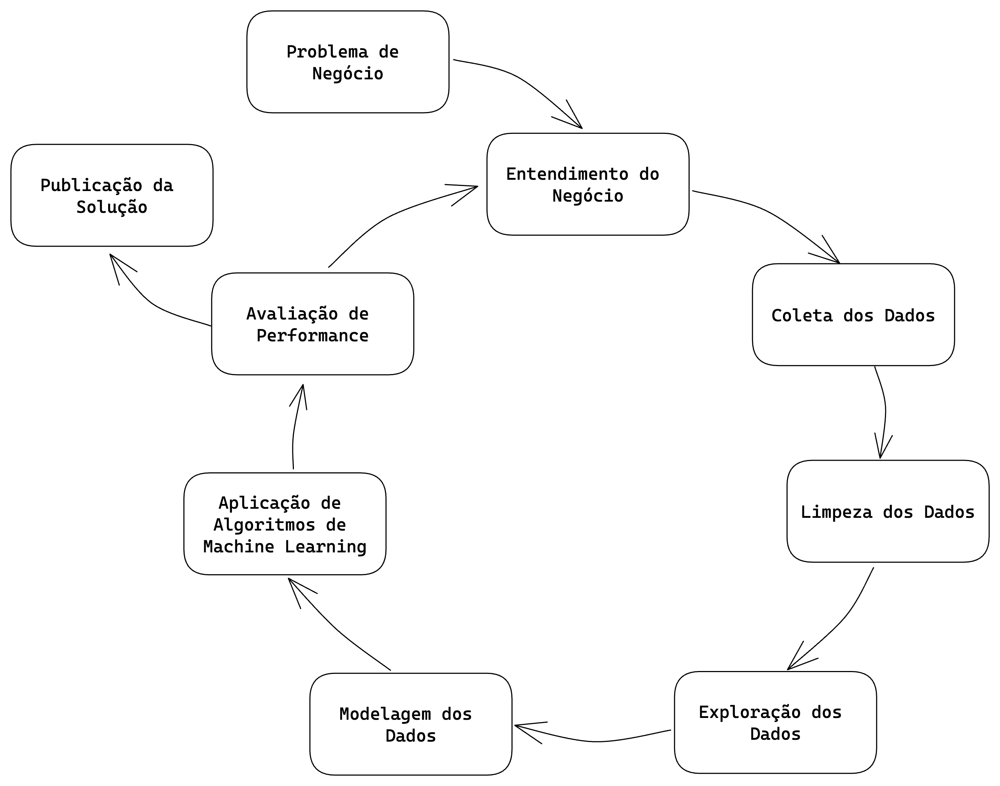

# Previsão de Vendas das Lojas Rossmann

Rossmann é uma das maiores redes de drogarias da Europa, com cerca de 56.200 funcionários e mais de 4.000 lojas. Em 2019, as lojas Rossmann tiveram um volume de negócios superior a 10 mil milhões de euros na Alemanha, Polônia, Hungria, República Checa, Turquia, Albânia, Kosovo e Espanha.

A empresa foi fundada em 1972 por Dirk Rossmann, com sede em Burgwedel, perto de Hanover, na Alemanha. A família Rossmann detém 60% da empresa. O AS Watson Group, com sede em Hong Kong, detém 40%, o qual foi adquirido da holandesa Kruidvat em 2004. Fonte: https://en.wikipedia.org/wiki/Rossmann_(company)

Através do site da Kaggle, a empresa disponibilizou nesta plataforma os seus dados de vendas de suas filiais. Nesta base de dados, constam 1 milhão de registros com 18 colunas únicas para cada venda.

# 1. Problema de Negócio

O Chief Financial Officer (CFO) da Rossmann deseja reformar as lojas da rede de farmácias, visando melhorar a estrutura e o atendimento ao público. Para isso, ele informou aos gerentes que precisa receber a previsão de receita das próximas 6 semanas de cada loja, a fim de determinar o valor a ser investido em cada uma delas.

Atualmente, as previsões são feitas individualmente por cada gerente de loja, resultando em variações significativas devido a fatores distintos que influenciam os resultados, como promoções, competição por clientes, feriados e sazonalidade. O processo de cálculo é manual, o que torna os resultados ainda mais inconsistentes.

O objetivo deste projeto é auxiliar o CFO na tomada de decisões, fornecendo previsões automáticas para cada loja e permitindo que ele consulte essas previsões através de um bot no aplicativo Telegram.

# 2. Premissas de Negócio

Para construir a solução, as seguintes premissas foram consideradas:

* A consulta da previsão de vendas estará disponível 24/7 e será acessível via um bot no aplicativo Telegram. Neste bot, o CFO deve digitar o número da loja de seu interesse.

* A previsão considerará apenas as lojas que tiveram vendas superiores a 0 nos dados disponíveis.

* Os dias em que as lojas estiveram fechadas serão excluídos da previsão.

* Lojas sem informações sobre competidores próximos terão a distância fixada em 200.000 metros.

## 2.1. Descrição dos Dados

| Atributo                          | Descrição                                                                                                                                             |
| :-------------------------------- | :---------------------------------------------------------------------------------------------------------------------------------------------------- |
| Store                             | Identificador único de cada loja                                                                                                                      |
| Date                              | Data em que ocorreu o evento de venda                                                                                                                 |
| DayOfWeek                         | Variável numérica que representa o dia da semana                                                                                                      |
| Sales                             | Valor de vendas do dia                                                                                                                                |
| Customers                         | Quantidade de clientes na loja no dia                                                                                                                 |
| Open                              | Indicador para loja aberta = 1 ou fechada = 0                                                                                                         |
| StateHoliday                      | Indica se o dia é feriado de estado. a = Feriado público, b = Feriado de páscoa, c = Natal, 0 = Não há feriado                                        |
| SchoolHoliday                     | Indica se a loja foi ou não fechada durante o feriado escolar                                                                                         |
| StoreType                         | Indica o modelo de lojas. Pode variar entre a, b, c, d                                                                                                |
| Assortment                        | Indica o nível de variedade de produtos: a = básico, b = extra, c = estendido                                                                         |
| CompetitionDistance               | Distância (em metros) para o competidor mais próximo                                                                                                  |
| CompetitionOpenSince [Month/Year] | Indica o ano e mês em que o competidor mais próximo abriu                                                                                             |
| Promo                             | Indica se a loja está com alguma promoção ativa no dia                                                                                                |
| Promo2                            | Indica se a loja deu continuidade na promoção: 0 = loja não está participando, 1 = loja participando                                                  |
| Promo2Since [Year/Week]           | Descreve o ano e semana de quando a loja começa a a promoção extendida                                                                                |
| PromoInterval                     | Descreve os meses em que a loja iniciou a promo2, ex.: "Feb,May,Aug,Nov" significa que a loja iniciou as promoções estendidas em cada um desses meses |

# 3. Estratégia da Solução

Para garantir uma entrega rápida e eficiente da primeira solução, com o objetivo de trazer valor para a empresa e permitir decisões ágeis por parte do CFO, foi adotado o método CRISP-DM. Este método é composto por 9 etapas cíclicas, em que aprimoramos o resultado de negócio a cada iteração dessas etapas. Buscamos entregas cada vez mais rápidas, de maior qualidade e com maior precisão. Isso possibilita que as equipes que utilizarão os resultados desenvolvidos tenham um produto minimamente utilizável já na primeira entrega, que será aprimorado ao longo do tempo.

## Passos do CRISP-DM:

1. **Problema de Negócio:** Esta etapa tem como objtive receber o problema de negócio que será resolvido. É nesta etapa que é recebido a pergutna ou o pedido feito pelo dono do problema, que no caso deste projeto, é o CFO da rede Rossmann.

2. **Entendimento de Negócio:** Esta etapa tem como objetivo entender a dor do dono do problema e qual a sua real necessidade. Nesta etapa podem surgir protótipos da solução para validar com o dono do problema o que ele deseja como solução. 

3. **Coleta de Dados:** Esta etapa tem como objetivo realizar a coleta dos dados, buscando eles nas tabelas do(s) banco(s) de dados da empresa. 

4. **Limpeza dos Dados:** Esta etapa tem como objetivo remover toda e qualquer sujeira nos dados. Um dado sujo pode ser entendido como um dado que irá atrapalhar a performance final do algoritmo de Machine Learning. Tomando o cuidado entender bem o fenômeno que está sendo estudado para que não sejam removidos dados importantes para a modelagem do problema.

5. **Exploração dos Dados:** Esta etapa tem como objetivo entender os dados e como eles se relacionam entre si. Normalmente, são criadas hipóteses acionáveis de negócio que são posteriormente validadas utilizando técnicas de análise de dados. Além da criação de novas *features* que serão utilizadas na etapa de Modelagem de Dados.

6. **Modelagem dos Dados:** Esta etapa tem como objetivo preparar os dados para que eles sejam utilizados pelos algoritmos de Machine Learning. É nesta etapa que são feitos as transformações e *encodign* dos dados, a fim de facilitar o aprendizado do algoritmo utilizado.

7. **Aplicação de Algoritmos de Machine Learning:** Esta etapa tem como objetivo selecionar e aplicar algoritmos de Machine Learning nos dados preparados nas etapas anteriores. É nesta etapa que são selecionados os algoritmos e feito a comparação de performance enetre eles, para selecionar o algoritmos que melhor performou como algoritmo final.

8. **Avaliação de Performance:** Esta etapa tem como objetivo verificar a performance do algoritmo selecionado na etapa anterior com os resultados atuais, ou *base line* atual. Neste momento é feito a tradução da performance do algoritmo para perfomance de negócio. Ou seja, quanto a solução criada tratrá de retorno financeiro para a empresa. Caso a performance seja aceitável, o algoritmo é publicado e é retornado para a etapa de entendimento de negócio novamente, a fim entender melhor possíveis lacunas e assim melhorar a performance do algoritmo selecionado. Caso a performance não seja aceitável, o algoritmo não é publicado e é retornado para a etapa de entendimento de negócio para fazer uma nova iteração e assim melhorar a performance da solução.

9. **Publicação da Solução:** Esta etapa tem como objetivo publicar o algoritmo selecionado, deixando publico e utilizável a solução criada.

## 3.1. Produto Final

Foi acordado com o CFO a criação de um bot a ser usado pelo aplicativo Telegram, onde ele poderá digitar o número de cada loja desejada para obter a previsão. Este bot retorna os valores de previsão da loja solicitada para as próximas 6 semanas.

Link da solução apresentada: https://web.telegram.org/k/#@arss_rossmann_bot

## 3.2. Ferramentas Utilizadas
Para criar a solução, foram utilizadas as seguintes ferramentas:
- Linguagem de Programação Python versão 3.12.1
- Versionador de código Git
- Aplicação Jupyter Notebook para prototipar a solução
- Serviço de Hospedagem em Nuvem
- Técnicas de manipulação de dados utilizando a linguagem de programação Python
- Técnicas de redução de dimensionalidade e seleção de atributos
- Algoritmos de Machine Learning da biblioteca [scikit-learn](https://scikit-learn.org/stable/) da linguagem de programação Python

# 4. Os 2 maiores Insights
Foi criado um Mindmap para ajudar na construção de Hipóteses, a fim de facilitar e delimitar o escopo da etapa de análise exploratória.

Através do Mindmap, foram geradas 19 hipóteses de negócio. Dessas, 12 foram selecionadas para validação, confirmando premissas da equipe de negócios e do responsável pelo problema. Além disso, foram gerados insights relevantes para ambos os grupos.

Dos 12 hipóteses verificadas, destacaram-se alguns insights, conforme abaixo:

## Lojas com maior sortimentos deveriam vender mais.

**FALSO** - Lojas classificadas como EXTRA é a que menos vende.

## Lojas com competidores mais próximos deveriam vender menos.

**FALSO** - Maior quantidade de vendas são as lojas com distâncias de até 1 Km, ou seja,mais próximas.

## Lojas deveriam vender mais no segundo semestre do ano.

**FALSO** As lojas vemde menos no segundo semestre.

# 5. Modelos de Machine Learning

No primeiro ciclo do projeto, foram selecionados cinco algoritmos para teste, visando identificar o algoritmo com melhor desempenho e custo de implementação. Nessa etapa inicial, optou-se pela simplicidade, considerando que era o primeiro ciclo do projeto e o objetivo principal era entregar uma solução minimamente utilizável para a equipe de negócios e para o CFO.

Os algoritmos selecionados foram:

Average Model
Linear Regression
Linear Regression - Lasso
Random Forest Regressor
XGBRegressor
Após a seleção dos algoritmos, procedemos com o treinamento e teste de cada um deles para avaliar sua performance. Além disso, utilizamos o método de seleção de features RFE para identificar as variáveis mais relevantes e impactantes na base de dados.

# 6. Seleção do Modelo de Machine Learning

## 6.1. Escolha da Métrica

Na escolha entre os algoritmos, utilizamos a métrica ***MAPE (Mean Absolute Percentage Error)***, que é uma medida de erro expressa em porcentagem média do erro em relação ao valor real. Optamos por essa métrica por ser mais compreensível para a equipe de negócios e para o CEO, uma vez que fornece uma representação percentual do erro em relação ao valor médio. Dessa forma, torna-se mais fácil interpretar e comunicar o desempenho dos algoritmos selecionados.

## 6.2. Métricas dos Algoritmos - *Time Series Cross-Validation*

Com esse método de validação, foram obtidas as seguintes performances:

| Nome do Modelo                |        MAE CV         |   MAPE CV     |       RMSE CV      |
| :-----------------------------|----------------------:|--------------:|-------------------:|
|Random Forest Regressor	    |   836.61 +/- 217.1	| 0.12 +/- 0.02	|1254.3 +/- 316.17   |
|XGBoost Regressor       	    |   976.93 +/- 212.85	| 0.14 +/- 0.02	|1402.85 +/- 303.16  |
|Linear Regression - Lasso	    |   2081.73 +/- 295.63	| 0.30 +/- 0.02	|2952.52 +/- 468.37  |
|Linear Regression	            |   2116.38 +/- 341.5	| 0.29 +/- 0.01	|3057.75 +/- 504.26  |

## 6.3. Escolha do Modelo

Embora o algoritmo ***Random Fores Regressor*** tenha apresentado a melhor performance, optou-se pelo algoritmo ***XGBoost Regressor*** nesta etapa.

- Primeiro, porque o erro entre esses dois algoritmos é pequeno.
- Segundo, porque o tempo de treinamento do ***XGBoost Regressor*** é mais rápido em comparação com o algoritmo ***Random Forest Regressor***.
- Terceiro, porque o modelo final treinado pelo ***XGBoost Regressor*** ocupa menos espaço do que o ***Random Forest Regressor***, tornando assim o uso de servidores em nuvem mais econômico.
E por último, nossa prototipagem não seria viável devido ao espaço reduzido na plataforma Render para alocar o modelo.

## 6.4. Ajuste de Hiperparâmetros

Foi o utilizado a técnica de Random Search para fazer a busca dos melhores hyperparâmetros. Os testes realizados foram os seguintes:

| Tentativa |             MAE CV |       MAPE CV |            RMSE CV |
| :-------: | -----------------: | ------------: | -----------------: |
|  Teste 1  | 1362.93 +/- 140.95 | 0.19 +/- 0.01 | 1942.03 +/- 186.99 |
|  Teste 2  | 1362.49 +/- 144.15 | 0.19 +/- 0.01 | 1945.98 +/- 190.84 |
|  Teste 3  | 1622.44 +/- 190.00 | 0.22 +/- 0.01 | 2347.52 +/- 262.46 |
|  Teste 4  | 1357.57 +/- 141.94 | 0.19 +/- 0.01 | 1946.68 +/- 191.32 |
|  Teste 5  | 1662.10 +/- 172.99 | 0.26 +/- 0.01 | 2395.35 +/- 220.54 |
|  Teste 6  | 1151.61 +/- 173.80 | 0.16 +/- 0.01 | 1621.78 +/- 231.41 |
|  Teste 7  | 1034.05 +/- 194.34 | 0.14 +/- 0.02 | 1474.85 +/- 282.47 |
|  Teste 8  | 1387.42 +/- 121.83 | 0.19 +/- 0.01 | 1982.98 +/- 154.25 |
|  Teste 9  | 1151.61 +/- 173.80 | 0.16 +/- 0.01 | 1621.78 +/- 231.41 |
| Teste 10  | 1261.38 +/- 239.01 | 0.17 +/- 0.03 | 1812.39 +/- 324.24 |

## 6.5. Performance do Modelo
Como podemos observar nos dois primeiro gráficos abaixo, o modelo selecionado obteve uma performance aceitável, visto que conseguiu entender e reproduzir o padrão de vendas ao longo dos anos estudados.

Já nos dois últimos gráficos, podemos observar uma distribuição normal a cerca das previsões, o que nos inidica um bom resultado do modelo selecionado, além de podermos verificar a distribuição dos erros do modelo.

# 7. Resultado de Negócio
Com o modelo selecionado e treinado, obtivemos a seguinte performance de negócio para as 5 melhores lojas:

| ID da Loja |     Previsões |  Pior Cenário | Melhor Cenário |       MAE |   MAPE   |
| :--------- | ------------: | ------------: | -------------: | --------: | -----:   |
| 726        | \$ 395,179.19 | \$ 394,561.25 |  \$ 395,797.12 | \$ 617.93 | 0.056653 |
| 1089       | \$ 372,965.75 | \$ 372,395.16 |  \$ 373,536.34 | \$ 570.59 | 0.056688 |
| 667        | \$ 320,221.94 | \$ 319,725.87 |  \$ 320,718.00 | \$ 496.00 | 0.056691 |
| 615        | \$ 337,795.78 | \$ 337,268.24 |  \$ 338,323.32 | \$ 527.55 | 0.058663 |
| 990        | \$ 240,249.75 | \$ 239,872.19 |  \$ 240,627.31 | \$ 377.56 | 0.059534 |

## 7.3 Total Performance

|    Scenario	      |       Values        |
|---------------------|---------------------|
|total_prediction	  | R$285,634,048.00    |
|worst_scenario_total |	R$284,792,165.56    |
|best_scenario_total  | R$286,475,951.92    |

# 8. Conclusões
Conforme foi verificado, o projeto solucionou o problema inicial de previsão de faturamento das lojas, que anteriormente era feito manualmente pelos gerentes.

Outro ponto importante a destacar é que, com a solução implementada, o CFO agora pode consultar as previsões das lojas de forma automática, utilizando o BOT criado. Isso proporciona maior agilidade na tomada de decisões.

# 9. Lições Aprendidas
* Priorização eficaz de tarefas e soluções.
* Adoção de uma abordagem cíclica no desenvolvimento, possibilitando entregas rápidas e contínuas.
* Implementação bem-sucedida de um BOT para o aplicativo de mensagens Telegram, visando agilizar o acesso às informações.

# 10. Próximos Passos

* Investigar detalhadamente as causas das previsões inadequadas em algumas lojas.
* Explorar a inclusão de diferentes algoritmos durante a próxima fase de treinamento para aprimorar a precisão das previsões.
* Desenvolver uma aplicação web usando o framework Streamlit, permitindo que os gerentes das lojas acessem e visualizem as previsões de forma fácil e intuitiva.
* Implementar testes unitários abrangentes para validar a funcionalidade das classes e funções desenvolvidas.
* Identificar e criar novas variáveis (features) que possam contribuir para melhorar o desempenho do modelo atual e futuros modelos de previsão.
* Aplicar técnicas avançadas de programação para otimizar a eficiência e o desempenho da solução.
* Investigar as razões para previsões imprecisas em algumas lojas.
* Explorar a inclusão de diferentes algoritmos durante o próximo ciclo de treinamento para aprimorar o desempenho das previsões.
* Desenvolver uma aplicação web utilizando o framework Streamlit para fornecer acesso online às previsões para os gerentes das lojas.
* Implementar testes unitários abrangentes nas classes e funções desenvolvidas para garantir a confiabilidade do código.
* Identificar e criar novas variáveis (features) que possam contribuir para a melhoria do desempenho do modelo atual e de futuros modelos de previsão.
* Aplicar técnicas avançadas de programação para otimizar a eficiência e o desempenho da solução criada.

